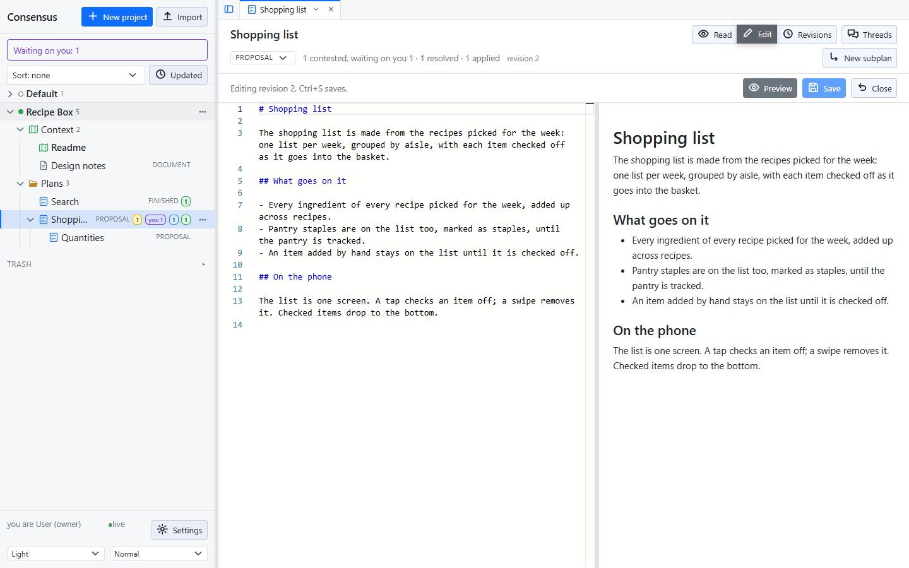
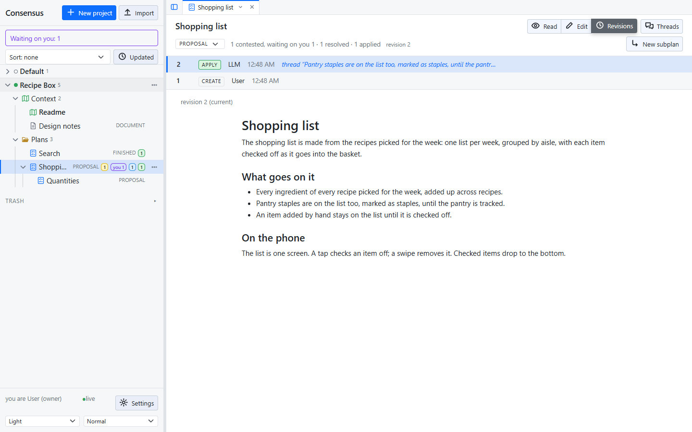
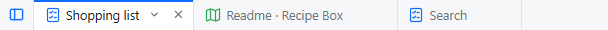

# Editing and revisions

A plan or document opens in **Read**, the rendered text. **Edit** opens the editor beside a live preview; **Revisions** shows the record. The three are in the heading, and Ctrl+E switches between Read and Edit, from the editor too.

## Editing

The editor is Monaco, the editor of VS Code, so the keys you know work: multiple cursors, find and replace, folding. Ctrl+S saves. **Preview** in the editor's heading hides or shows the preview, and the choice is remembered in the browser.

Editing is allowed at any time and makes a new revision. A manual edit changes no thread's status, and the anchors follow the text, so you can tidy a plan while its threads are open.

Two people cannot overwrite each other: a save carries the revision it was made from, and a stale one is refused. The page reloads the newer text rather than losing it.

## Revisions

Every save, and every applied thread, is a revision. **Revisions** lists them, newest first: who, when, which thread was applied and its outcome, and the text as it stood. The document keeps no change log of its own; the revisions and the applied records are the record.

## Tabs

Every item you open, and Waiting on you, opens in a **tab** above the document: one tab per item, dragged to reorder, closed with ×. Each tab comes back as you left it, Read, Edit or Revisions, an unsaved edit included. Open tabs survive a page reload, not a browser restart; with none open, the start page shows.

A tab's menu (the ▾ beside its ×, or a right-click) has Close, Close others, Close to the right, Close all, and **Detach**, which opens the item in its own browser window, without the sidebar; allow pop-ups for the page. Its tab stays in the strip, ghosted, and its menu has **Re-attach** and Close. Re-attach in the window does the same. Two windows, and two browser tabs, stay in step: every change is pushed live.

## The threads pane and the tree

The heading's **Threads** button hides or shows the threads pane, and the sidebar can be hidden too; each is remembered in the browser. A document gives the threads pane's room to the text.
