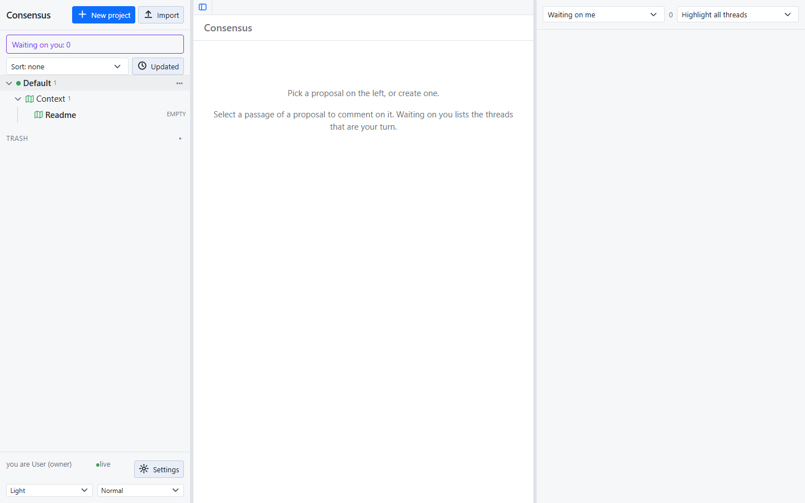
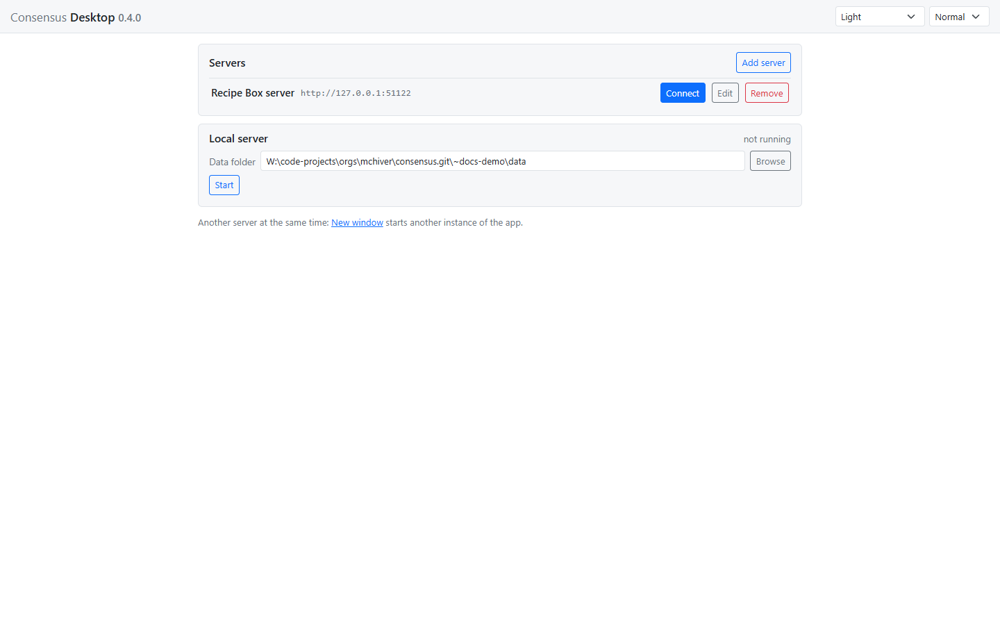

# Getting started

Consensus-AI is a web application you run yourself. It keeps your plans as plain files in a folder, shows them in a browser, and lets an LLM take part through its API. This page gets it running in the three ways there are: from the checkout, in Docker, and as the desktop application.

The code is public at [github.com/mchiver/consensus-ai](https://github.com/mchiver/consensus-ai). An installer is coming; until then, every way starts from the checkout.

## From the checkout

You need Node 22 or later and git.

```
git clone https://github.com/mchiver/consensus-ai.git
cd consensus-ai
npm install
node bin/consensus.js
```

The server prints its address, its data folder and its settings file:

```
Consensus at http://127.0.0.1:3500/ (listening on 127.0.0.1)
data folder W:\consensus-ai\~data
settings written to W:\consensus-ai\~data\consensus.json
```

Open `http://127.0.0.1:3500/` in a browser. You are the owner, and you see the **Default** project with its Context folder and an empty Readme.



Three options change where and how it runs:

| Option | What it does |
| --- | --- |
| `--data <folder>` | the data folder; `~data/` beside the checkout by default |
| `--port <port>` | the port; 3500 by default |
| `--host <address>` | the address to listen on; `127.0.0.1` by default, `0.0.0.0` for every interface |

Listening beyond your own machine is a decision: anyone who can reach the server acts as the owner. Keep it on `127.0.0.1` unless the network is yours.

## In Docker

The repository holds a `Dockerfile` and a `compose.yaml`. From the checkout:

```
docker build -t consensus:latest .
docker compose up -d
```

The server listens on port 3500 and keeps its data in the `consensus-data` volume. `docker compose down` stops it; the volume stays. The `compose.yaml` as shipped publishes the port on every IPv4 address of the host, because it is written for a server on a private network; edit it for your own.

## The desktop

Consensus Desktop is the same page in a window of its own, able to connect to any Consensus server and to run one locally. From the checkout:

```
npm run desktop
```

It opens on the **connect screen**.



- **Servers** lists the servers you saved. **Add server** asks for a name and a URL, tries the address before saving it, and says which Consensus version answers.
- **Local server** runs Consensus inside the app over a data folder you pick with Browse. Start it, then Connect. Closing the window stops it.

Once connected, the window shows the page, and the **Server** menu has Connect to another, Reload, the local server's Start and Stop, and New window for a second server. The desktop also brings LLM connections and workspaces of its own; the page [Working with an LLM](llm.html) covers them.

## What to do first

1. Open the Readme in the Context folder and write a few lines about what the project is for. Every LLM that works on the project reads it.
2. Make a plan with **New plan** in the project's menu, and write a draft.
3. Select a sentence of the draft and comment on it. That is a thread, and the rest of this guide is about what happens next.
