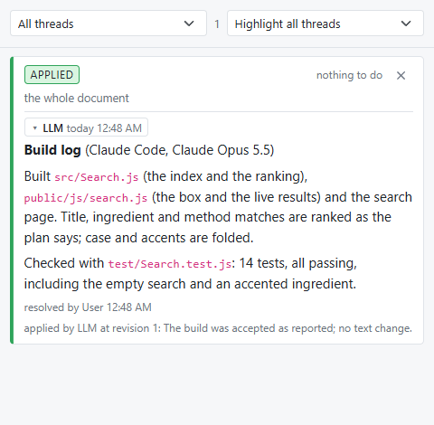
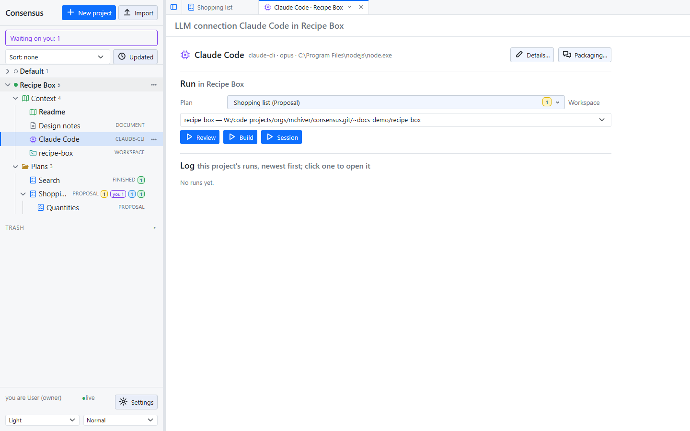
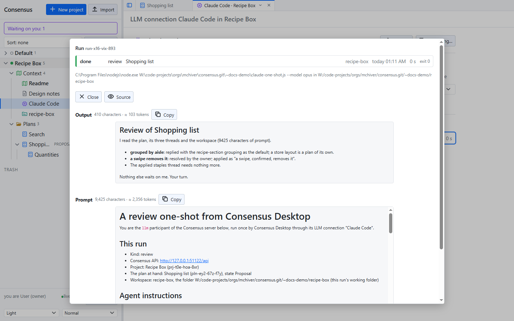

# Working with an LLM

The server itself calls no model, reads no code and indexes nothing. Every LLM takes part as the **llm** participant, through the API, from wherever it runs: a coding agent in your repository, a one-shot run from the desktop, or a local model. What they all do is the same: read what waits on them, reply, apply what you resolved, draft plans, and build what a finished plan says.

## The llm participant and its token

The settings list the participants. The llm participant holds a **token**; a request with `Authorization: Bearer <token>` is that participant. **Settings** at the bottom of the sidebar shows the participants: **New** makes a token, **Copy** copies it. See [Settings and themes](settings.html).

## Giving an LLM the instructions

Your server serves its own guide for LLMs at `/instructions`: what Consensus is, how to call the API, what your words mean ("check consensus", "your turn", "build it"), and the build loop. Its first section, **This server**, holds the API's address as the request reached it and the llm participant's token, so an LLM that has read the page has everything it needs to take part. Nothing is installed or configured on the LLM's side.

How you hand the page over depends on what runs the LLM:

- **An agent session** (Claude Code, or another coding agent with a shell) open on your repository: one line in the chat starts it.

  > Read the instructions at `http://127.0.0.1:3500/instructions` with curl, then load your context.

  Say "with curl": an agent's web-fetch tool often refuses a local or private address, and curl does not. "Load your context" has it read the project's Readme, the tree of plans and what waits on it, and report back in a few lines. From then on, "your turn in Consensus" is the whole prompt. Give the address the agent can reach: `127.0.0.1` for a server on the same machine, the server's name on your network otherwise.

- **A one-shot from the desktop**: nothing to do. The packaged prompt starts with the server's `/instructions` (the Packaging popup lists it, checked by default), so the model is briefed on every run.

- **A local model through Ollama**: the desktop swaps the page for its own tool instructions, because the model works through the desktop's tools rather than the API, and the token never enters its prompt.

- **Anything else** that can make HTTP requests: fetch the page, give it to the model as its system or first message, and let it call the API as the page says.

The page is the guide the repository keeps at `.guides/build-with-consensus.md`; the server only puts This server at the top. Keep it in mind when the server listens beyond your machine: anyone who can reach it reads the token there.

## Your turn in Consensus

The loop you will use most, with an agent session such as Claude Code open on your repository:

1. You comment on a plan, or resolve threads. The plan's row shows what waits on the llm.
2. You tell the session "your turn in Consensus". It fetches what waits on it, replies to the contested threads, and applies the resolved ones: one revision each, with the outcome recorded on the thread.
3. You read its replies in the threads pane, resolve what you agree with, answer what you do not, and say "your turn" again.

Two words of yours have a fixed meaning for the session. "Check consensus" means report what changed and act on nothing. A message holding a question is answered only; its instructions wait for a message with no question.

## The build loop

When every thread of a plan is resolved and applied, you say "build it". The session sets the plan's state to Working, implements what the plan says, runs the tests, and posts one thread on the whole plan: the **build log**, saying what was built, where, how it was checked, and which model built it.

You accept by resolving the build log; the session applies it, commits the work in your repository, sets the plan to Finished and brings the project's Readme up to date. You send it back by replying instead: it fixes what the reply asks and reports again on the same thread. Nothing is committed until it is accepted, and nothing in Consensus ever branches, commits or pushes on its own.

## In the desktop: connections and workspaces

Consensus Desktop runs an LLM for you, once per click. Its **LLM connections** and **workspaces** are the desktop's own, kept in its settings and shown in every project's Context folder, never on the server.

- An **LLM connection** is a model and how to run it: **Details** names it, picks the kind, `claude-cli` (a command run without a shell) or `ollama`, the command and its arguments, the model, a timeout, and for Ollama the context window and the most tool rounds a run takes. **Check** tries the connection as entered.
- A **workspace** is a folder on your machine attached to a project, with Include and Exclude globs, and the **Commands** a model may run, one per line, none by default.

The **LLM page** packages a prompt from the server's instructions, the project's Readme, the other Context documents you check, and the threads of the plan at hand that wait on the llm; **Packaging** picks the pieces and previews the result with its size. Then one of three buttons runs it once:

- **Review** reads the workspace and the plan, replies and applies. Read-only file tools.
- **Build** implements the plan in the workspace, with write, edit and the commands you allowed.
- **Session** is a build with your own prompt.

Every run is logged, newest first, and opens in a popup with its prompt and its output rendered or as source.

A `claude-cli` run hands the package to the command on its standard input; the model works through the API itself. An `ollama` run keeps the model's tools in the desktop: the desktop carries out each call the model makes (over the workspace, and over the server as the llm participant) and sends the result back, round by round, until the model answers. The token never enters a local model's prompt. The desktop never commits, branches or pushes.
