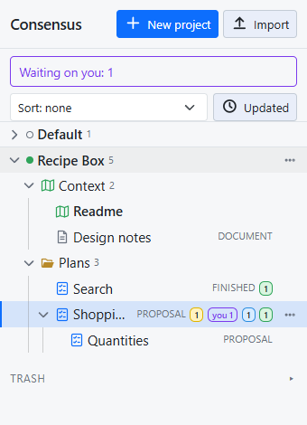
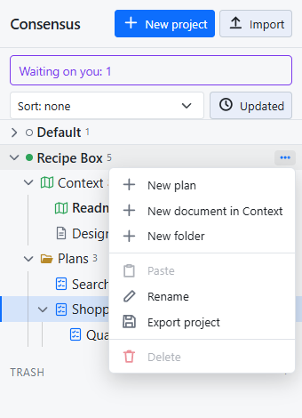

# Projects, plans and documents

Everything in Consensus-AI lives in a **project**. The sidebar on the left is a tree of projects; each one holds plans, documents and folders.

## The tree

One project is open at a time: opening one closes the others, and opening an item opens its project. The open project carries a solid green dot, the others a hollow circle. Each row shows a plan's state, its thread tallies, and a "you" badge when something waits on you.

Each row's actions are in its menu: the **⋯** at the row's end, or a right-click. Click a folder to make it where new items go; click it again for the project root. Click a folder's chevron to fold it.

## What a project holds

- **Plans** are what you discuss. A plan has text, threads and a **state**: one of the states in the settings, Proposal, Plan, Working and Finished by default. Anyone changes the state at any time from the picker in the heading; nothing locks, and a state does not depend on the threads.
- **Documents** are markdown with revisions, but no threads and no state. Documents live only in the project's Context folder.
- **Folders** organize plans, as deep as you like.
- **Subplans**: a plan can hold plans, and only plans. A Subplan is a full plan of its own, with its own threads and state; the tie is organizational. Subplans fold under their parent, and move, copy and go to the trash with it.

## The Context folder

Every project has one, first in its tree. It holds the project's **Readme**, a short account of what the project is and what has been decided, for everyone who works on it, and any other document. An LLM reads the folder's documents for the project's background, so the Readme is the first thing to write.

The folder holds documents only. **New document** in the project's menu, or the folder's, puts one there. Neither the folder nor the Readme is renamed, moved, copied or deleted; the other documents are items like any other.

## Making things

- **New project** at the top of the sidebar.
- **New plan**, **New folder** and **New document** in a project's menu; New plan and New folder in a folder's menu too, which create in it.
- **New Subplan** in a plan's menu, or **New subplan** in the heading of a plan with none yet. From a thread being written or replied to, **Start a new Subplan** starts one with the anchored passage and the thread so far quoted, and the thread gets a reply linking to it. Selected text can start one too: the Subplan starts with that text, and the parent is not changed.

The **Default** project is there from the first start and is never deleted; ad-hoc items live there.

## Moving, copying and deleting

Everything reorders by drag and drop. Drop an item on the top or bottom edge of a row to put it before or after that row, on the middle of a folder to move it inside, on the middle of a plan to make it a Subplan, or on a project's heading to move it to that project's root. Drop a project's heading on another's to reorder the projects.

**Rename** is in the menu; for a plan or document only its title changes. **Copy** (the menu, or Ctrl+C on the open item) and **Paste** (in a project's or folder's menu, or Ctrl+V into the open project) make a whole copy under a new id: a plan's text, threads and revisions, or a folder's whole contents.

**Delete** is in the menu only, confirmed on the row. A plan or document goes to the **Trash** at the bottom of the sidebar; a project or folder is deleted only when it is empty.

Every item belongs to exactly one project. To reuse one elsewhere, copy it and move the copy.
