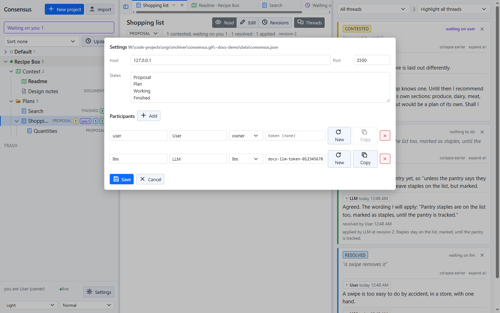

# Settings and themes

**Settings** at the bottom of the sidebar opens the server's settings in a popup, for the owner. Theme and size are beside it, for everyone.



## Host and port

The address the server listens on and its port. `127.0.0.1` listens on this machine only; `0.0.0.0` on every interface. Both take effect at the next start, and the popup says so.

## States

The states a plan's state is picked from, one per line: Proposal, Plan, Working and Finished by default. A new plan starts in the first. A state still used by a plan cannot be removed.

## Participants

Each participant has a name, a display name, a role and, for one that calls the API from outside, a token.

- **owner** resolves threads and edits the settings. A request with no token is the owner: the browser.
- **llm** is a full participant that is asked to apply resolved threads.
- **member** takes part in discussion.

**New** makes a token, **Copy** copies it. There must be exactly one owner, and no name twice.

Saving writes the whole file and applies it at once, Host and Port excepted. The server's own checks apply, and nothing is saved while there are problems; the popup lists them.

## The settings file

The settings are `consensus.json` in the data folder, written at first start:

```
{
	"Port": 3500,
	"Host": "127.0.0.1",
	"States": [ "Proposal", "Plan", "Working", "Finished" ],
	"Participants": [
		{ "Name": "user", "Display": "User", "Role": "owner" },
		{ "Name": "llm", "Display": "LLM", "Role": "llm" }
	]
}
```

The file is read once at start, so an edit by hand needs a restart; the popup does not.

## Theme and size

Light, dark or the system's theme, and three sizes, are at the bottom of the sidebar. They are kept in the browser, per user and per server, not in the settings. The desktop offers a wider choice of palettes, from Sepia and Paper to Nord and Midnight, and its title bar follows.

## The data folder

Everything is plain files in the data folder, `~data/` beside the checkout by default:

```
consensus.json                   the settings
projects.json                    every project's name, in display order
projects/<id>/project.json       a project's tree
proposals/<id>/proposal.md       a plan's or document's text
proposals/<id>/threads.json      its threads
proposals/<id>/revisions/        every revision's text and record
trash/<id>/                      a deleted item, moved whole
```

Back it up by copying the folder.
