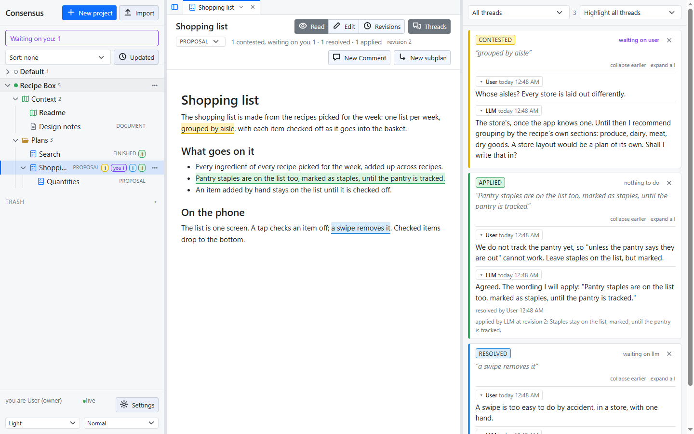
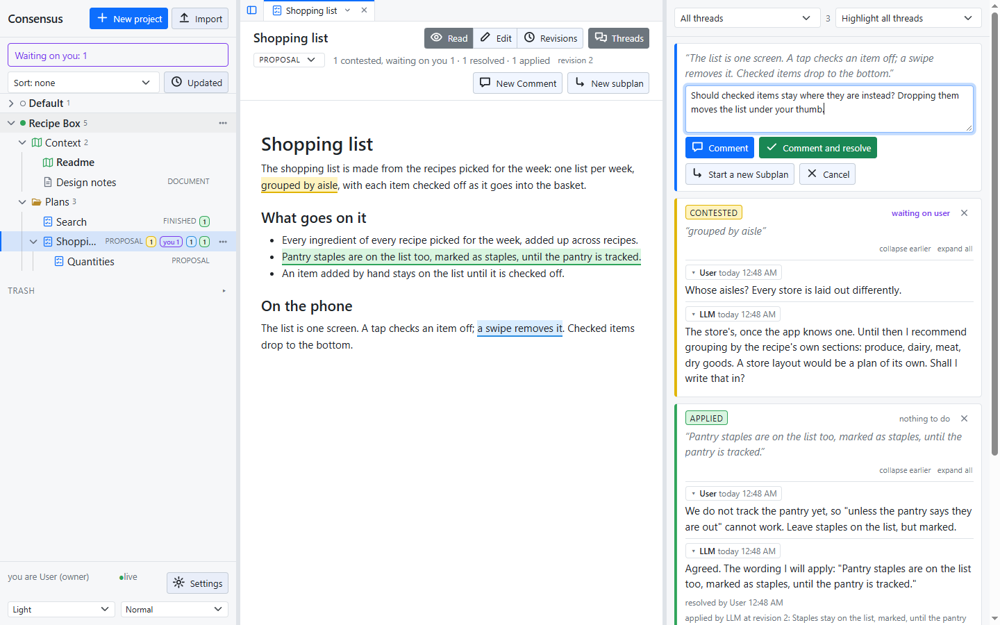
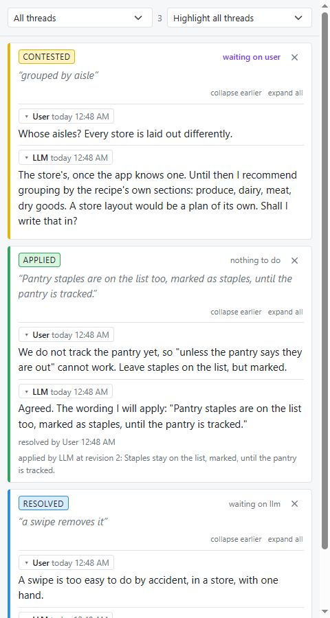
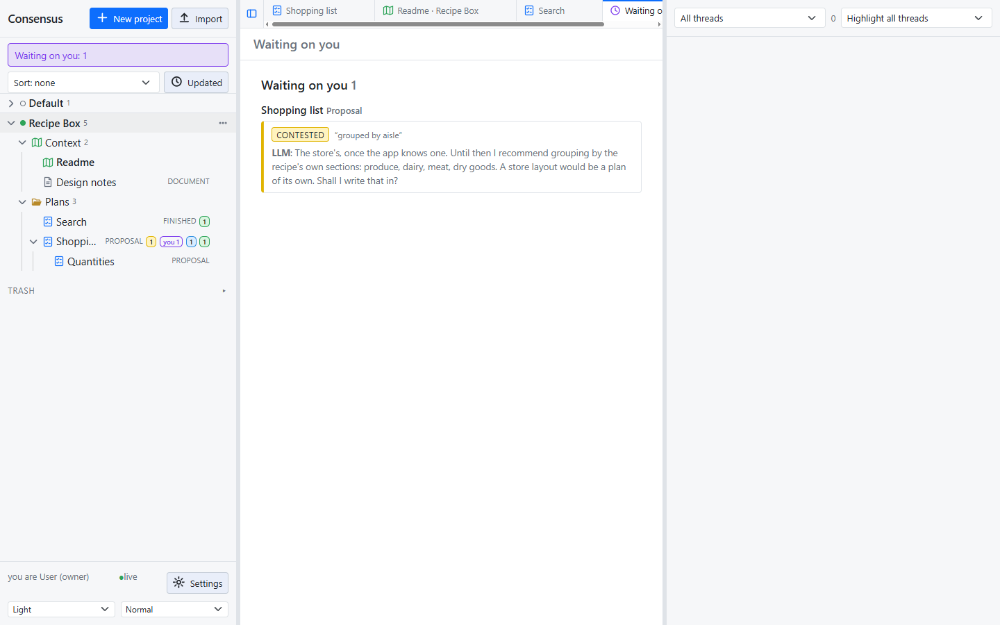

# Threads

A thread is a comment on a plan, and the way a plan is settled. You comment on a passage, the LLM replies, you resolve, and the LLM applies the outcome to the text. The plan is done when every thread is applied.

## Starting one

Select text in the plan, click **Comment**, write and post. The thread is **anchored** to the words you selected, which are highlighted in the text. A comment with nothing selected is on the whole document.

## The three states

Every thread is in one of three states, and the colour of its passage says which.

- **Contested** (yellow): under discussion. The thread waits on everyone except the one who replied last, so a reply hands it over.
- **Resolved** (blue): the owner has settled it, and it waits for the LLM to apply the outcome. It never looks finished before the text shows it.
- **Applied** (green): the LLM changed the text, or confirmed that nothing had to change, and recorded who, when, the revision and the outcome.

Any reply to a resolved or applied thread **reopens** it (orange): contested again, marked reopened. Reopening never reverts a change already applied; resolving it again makes it wait to be applied again.

## Resolving

Only the owner resolves, and in one of two ways:

- **Reply and resolve** posts your reply and resolves the thread with it. Your reply is the outcome the LLM applies, read as the answer to the question before it.
- **Resolve** with no reply accepts the outcome, or the recommendation, in the last reply.

Resolving means agreeing with how the thread was deliberated and decided, not with any one line in it: the last reply states what goes in.

## Whose turn

The sidebar's **Waiting on you** shows every thread waiting on you, across projects, and opens the Waiting tab. The threads pane filters by state and by whose turn it is, and a plan's row shows a "you" badge with the count.

## Anchors that follow the text

An anchor holds to the visible words, not the markdown, so bold and links do not break it. After every change to the text each anchor is found again: one whose words changed a little follows them; one that cannot be found is **detached**, shown first in the pane, and can be re-anchored by selecting text.

## Deleting

The owner deletes a thread with the **×** on its first line. A revision that applied a deleted thread keeps its text and shows "(deleted thread)".
